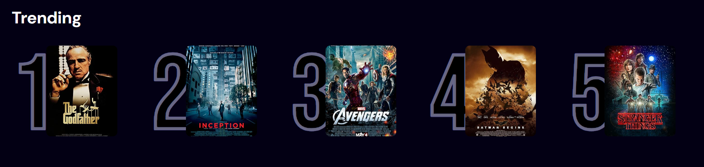

# 🎥 movie-search-appwrite

A modern React + Tailwind + Appwrite powered movie browsing and analytics app.



---

## 🧠 Overview

`movie-search-appwrite` is a modern React-based web application designed for efficient movie browsing and real-time analytics. Built using **Vite** and styled with **Tailwind CSS**, the project integrates with **Appwrite** to track trending searches and user interactions.

The app provides a seamless experience for searching movie titles and visualizing search trends dynamically.

---

## 🚀 Features

* 🔎 **Live Search**: Instantly search and fetch movies based on user input.
* 📈 **Dynamic Trending**: Trending section updates in real-time based on recent searches.
* 🎨 **Modern UI**: Tailwind-powered design for a clean, responsive layout.
* ⚡ **Fast Build**: Developed with Vite for lightning-fast HMR (Hot Module Replacement).
* 🧱 **Modular Components**: Built using reusable React components.
* 🌐 **Appwrite Integration**: Real-time backend to track and serve trending movie analytics.
* ✨ **Debounced Input**: Optimized input field using `useDebounce` for minimal API hits.

---

## 🔧 Tech Stack

* **React.js** – Frontend library
* **Vite** – Development bundler
* **Tailwind CSS** – Styling framework
* **Appwrite** – Backend as a service for analytics
* **JavaScript** – Programming language

---

## 💡 How it Works

1. Home page shows an empty search field and trending movie titles.
2. User starts typing a movie name in the search bar.
3. A **debounced** search query is triggered (to reduce API calls).
4. The movie data related to the query is fetched and displayed.
5. The **trending** section updates based on the new search input.
6. Movie cards are rendered in a responsive grid format using `<MovieCard />` components.

---

## 🛠️ Getting Started

### Prerequisites

* 📦 **Package Manager**: `npm`
* 📉 JavaScript and basic familiarity with React

### Installation

1. **Clone the Repository:**

```bash
git clone https://github.com/rishav-RG/movie-search-appwrite
```

2. **Navigate to the project folder:**

```bash
cd movie-search-appwrite
```

3. **Install dependencies:**

```bash
npm install
```

### Usage

To run the project locally:

```bash
npm start
```

---

## 📄 License

This project is licensed under the MIT License - see the [LICENSE](./LICENSE) file for details.

---

## ✨ Acknowledgments

Special thanks to [Appwrite](https://appwrite.io/) and [OMDb API](https://www.omdbapi.com/) for providing the tools and data to build this project.
